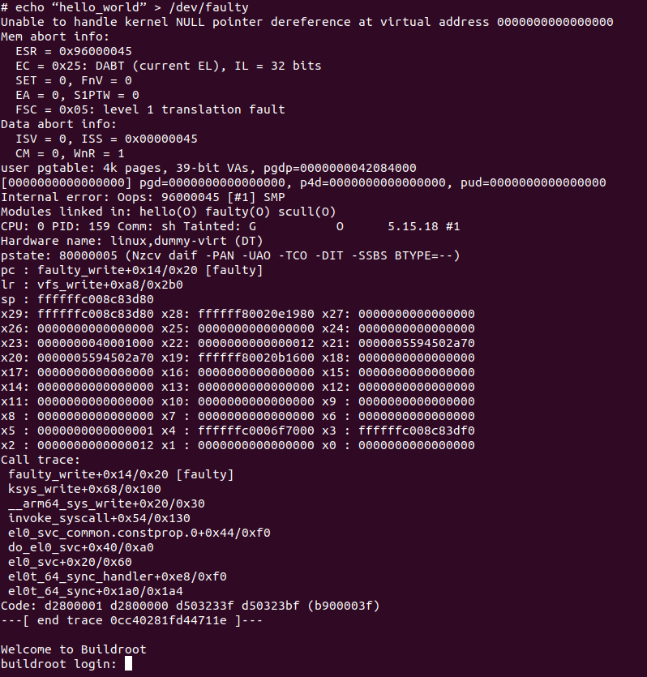

# ANALYSIS FOR KERNEL FOR FAULTY DRIVER OOPS MESSAGE
The focus of this analysis is on understanding the cause and implications of the kernel oops. The kernel Oops message occurs when the Linux kernel detects a critical error during its execution, leading to the kernel's termination to prevent potential data corruption or system instability.

## Commands:
- Building kernel using build.sh and then running the QEMU instance using runqemu.sh from [Isha Sharma's Buildroot Assignment for AESD](https://github.com/cu-ecen-aeld/assignment-5-ishassharmaa.git).
- Purposely trigger the oops message by sending `echo “hello_world” > /dev/faulty` command.

## Output:
 

## Analysis:
1) The line below suggests that the defreneced a NULL address pointer. This lead to a page fault and it may leave a system to kill all the tasks and leak resources. 

``` 
Unable to handle kernel NULL pointer dereference at virtual addres 0000000000000000
```

2) The PID of the process that cause the fault is mentioned along with the function 'faulty_write' in the faulty module, which was the exact function that caused it. 

```
CPU: 0 PID: 159 Comm: sh Tainted: G           O      5.15.18 #1
...
pc : faulty_write+0x14/0x20 [faulty]
````

3) The call trace futher proves that faulty_write was indeed the culprit. 
```
Call trace:
 faulty_write+0x14/0x20 [faulty]
 ksys_write+0x68/0x100
 __arm64_sys_write+0x20/0x30
 invoke_syscall+0x54/0x130
 el0_svc_common.constprop.0+0x44/0xf0
 do_el0_svc+0x40/0xa0
 el0_svc+0x20/0x60
 el0t_64_sync_handler+0xe8/0xf0
 el0t_64_sync+0x1a0/0x1a4
Code: d2800001 d2800000 d503233f d50323bf (b900003f) 
---[ end trace 0cc40281fd44711e ]---

```

4) The register information for the link register, stack pointer and are also shown. 
```
lr : vfs_write+0xa8/0x2b0
sp : ffffffc008c83d80
x29: ffffffc008c83d80 x28: ffffff80020e1980 x27: 0000000000000000
x26: 0000000000000000 x25: 0000000000000000 x24: 0000000000000000
x23: 0000000040001000 x22: 0000000000000012 x21: 0000005594502a70
x20: 0000005594502a70 x19: ffffff80020b1600 x18: 0000000000000000
x17: 0000000000000000 x16: 0000000000000000 x15: 0000000000000000
x14: 0000000000000000 x13: 0000000000000000 x12: 0000000000000000
x11: 0000000000000000 x10: 0000000000000000 x9 : 0000000000000000
x8 : 0000000000000000 x7 : 0000000000000000 x6 : 0000000000000000
x5 : 0000000000000001 x4 : ffffffc0006f7000 x3 : ffffffc008c83df0
x2 : 0000000000000012 x1 : 0000000000000000 x0 : 0000000000000000
```

5) If we look closely at the faulty_write function, we can see that it deferences a NULL pointer on purpose. 
```
ssize_t faulty_write (struct file *filp, const char __user *buf, size_t count, loff_t *pos) {
	/* make a simple fault by dereferencing a NULL pointer */
	*(int *)0 = 0;
	return 0;
}
```

## Conclusion:
The kernel Oops message generated after running the echo "hello_world" > /dev/faulty command indicates a critical error in the faulty driver code, leading to a kernel access violation and triggering a segmentation fault. Developers should carefully review and debug the faulty driver code to ensure proper handling of input data and prevent similar issues in the future.


